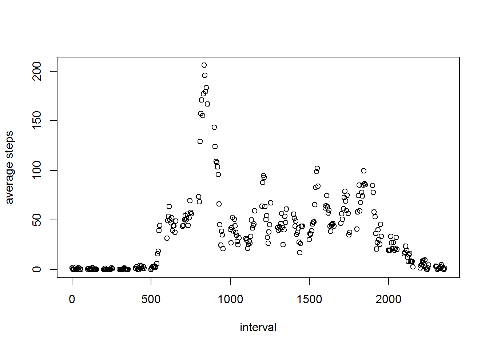

# Peer Assignment 1
Ryuta Hosaka

## Load and process data
Loading data from the file and convert date to date type.
```{r, echo=TRUE}
act <- read.csv("activity.csv", header = TRUE)
act$date <- as.Date(act$date, "%Y-%m-%d")
```

## What is the mean total of number of steps taken per day
Aggregate data by date and calculate mean and median of total steps by day.
```{r, echo=TRUE}
library(dplyr)
library(ggplot2)
stepsByDate <- aggregate(act$steps ~ act$date, FUN = sum)
stepsByDate <- rename(stepsByDate, day = `act$date`, totalSteps = `act$steps`)
mean(stepsByDate$totalSteps)
median(stepsByDate$totalSteps)
```
Plot steps by date by histogram.
```{r}
ggplot(data=stepsByDate, aes(x=stepsByDate$day, y=stepsByDate$totalSteps))+geom_bar(colour="grey", stat="identity")+xlab("date")+ylab("total steps")+ggtitle("Steps by Date")
```


## What is the avarage daily activity pattern
Aggregate steps by each interval time and then calculate average
```{r, echo=TRUE}
avgStepsbyInt <- aggregate (act$steps ~ act$interval, FUN=mean)
avgStepsbyInt <- rename(avgStepsbyInt, interval = `act$interval`, avgSteps = `act$steps`)
```
Max average steps is found at interval `r avgStepsbyInt[avgStepsbyInt$avgSteps == max(avgStepsbyInt$avgSteps), 1]`.
Below chart is showing time series plot of average steps.
```{r, echo=TRUE}
plot(avgStepsbyInt$interval, avgStepsbyInt$avgSteps, xlab = "interval", ylab = "average steps")
```


## Impute missing values
Total number of missing values is `r sum(is.na(act$steps))`.
Then next is to fill missing values. In this case I used average value by each step which I simply overwrite if original value is NA.
```{r, echo=TRUE}
act2 <- act
for (i in seq_along(act2$steps)){
  +     if(is.na(act2$steps[i])) act2$steps[i] <- avgStepsbyInt[avgStepsbyInt$interval == act2$interval[i], 2]
  else act2$steps[i] <- act2$steps[i]
}
stepsByDate2 <- aggregate(act2$steps ~ act2$date, FUN = sum)
stepsByDate2 <- rename(stepsByDate2, day = `act2$date`, totalSteps = `act2$steps`)
```
To make sure this logic works, total NA value in this new this data set act2 is `r sum(is.na(act2))`.
With this new data set, mean is calculated as `r mean(stepsByDate2$totalSteps)` while median as `r median(stepsByDate2$totalSteps)`.
This is a barchart to show total number of steps with new data set (imputed).
```{r}
ggplot(data=stepsByDate2, aes(x=stepsByDate2$day, y=stepsByDate2$totalSteps))+geom_bar(colour="grey", stat="identity")+xlab("date")+ylab("total steps")+ggtitle("Steps by Date - NA imputed")
```


## Difference in activity patter between weekday and weekend
I've created a function to flag weekday/weekend with weekday value derived from the date (with weekdays function). Here is the steps to create new data set to aggregate average value by date day type and interval.
```{r}
source('C:/Users/hryut/OneDrive/Documents/R Projects/Coursera-DS-5-WK2/flagweekday.R')
act$dayofweek <- lapply(act$date, FUN=weekdays)
act$weekdayflag <- lapply(act$dayofweek, FUN=flagweekday)
act$dayofweek <- as.character(act$dayofweek)
act$weekdayflag <-as.character(act$weekdayflag)
avgStepsByIntWdWe <-aggregate(act$steps ~ act$weekdayflag*act$interval, FUN=mean)
avgStepsByIntWdWe <- rename(avgStepsByIntWdWe, weekdayflag = `act$weekdayflag`, Interval = `act$interval`, avgSteps = `act$steps`)
```
And this is the plot to show the pattern of activity by day tyupe.
```{r}
library(lattice)
xyplot(avgSteps ~ Interval | weekdayflag, data = avgStepsByIntWdWe, type = "l", xlab = "interval", ylab = "Average Steps", layout = c(1,2))
```

